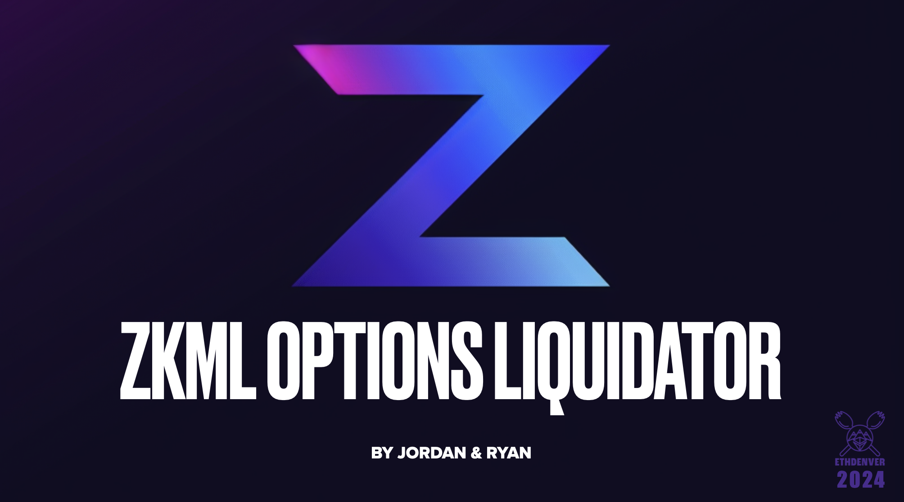
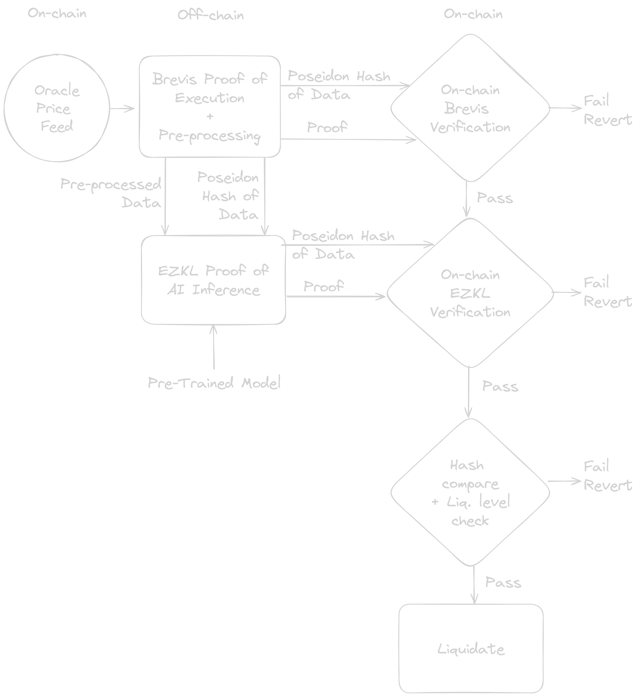

# ZKML Options Liquidator

See install and try instructions [here](HOWTO.md).

## Abstract

Anybody can calculate the liquidation levels, prove the calculation, submit the proof with liquidation request and execute.

For protocols with complicated calculations of liquidation levels (not lending). Derivatives, options, structured products.

## Tagline
Permissionless Options Liquidation system, using ZKML to prove complex off-chain calcualations so anyone can make profit liquidating delinquent  actors and keep the protocol safe for the good actors.

## The problem it solves
Unlike other DeFi protocols, on-chain options need complicated calculations to derive liquidation levels. Traditionally the Black-Scholes formula is used in reverse to calculate "Implied Volatility" by looking at existing trades and then again a similar forward calculation to derive pricing and liquidation levels. We have achieved better results by training an AI / Machine Learning model. However, using off-chain calculations cannot be trusted for performing liquidations with serious financial consequences. To remedy this, we freeze the trained AI model and weights and hash it. Then for the inference (calculation) process, we produce a validity proof of the calculation using the Zero Knowledge Machine Learning (ZKML) system EZKL. In addition, we produce a proof of genuine validity of the input data used in the calculation, which comes from ChainLink price feed oracles unsigned. To achieve this, we use the Aztec Barretenberg proof system and write proofs od ECDSA signatures of the Chainlink aggregator EVM transactions that entered the data. Finally, as both ZK systems have incompatible verifiers, we use a common Poseidon hash as public input to both proofs, and verify them on-chain independently within the same Solidity function call. After the verification, the liquidation level is checked for the target account and if the collateralization is below it, the delinquent account can be liqudated. The on-chain validity verification allows anyone to perform the above operaions permissionlessly. This keeps the honest participants and the protocol safe, while liquidating the delinqunet actors timely. Anyone can permissionlessly compete for the liqudation penalty charged to the liqudated account by performing an operation that keeps participants honest.

## Challenges we ran into
We tried multiple proving systems. Emulating step-py-step AI inference operations turned to be very costly. Finally we found EZKL, a system that is optimized for matrix multiplication operations for Machine Learning. The learning process is still too resource consuming, so we train it before the Options Contracts are created. Then we commit the state of the trained model (topology, normalizarion and weights). This reduces the problem to running only inference. Luckily, all inputs are public, so we can send the proof generation to a cloud provider specialized for this.

The second problem was the validity of the input data. We could not find a ZK-friendly oracle. The trust on all oracles is achieved by consensus, and that cannot be proven by ZK systems. To alleviate this issue, we take the Oracle Price Feed transactions, verify the ECDSA signatures sent to the blockchain and produce a proof of ECDSA. We wrote this in Noir.

Finally, we have two incompatible proving systems, and we could not aggregate them into a single proof. Running separate verifiers could allow omeone to prove genuinity of some data and submit other data to the liquidity level calculation verifier, thus faking the whole process. To solve this problem, we hashe the entire input set using Poseidon hash and feed it to both proofs, which incorporate it among the other constraints.

This is a DeFi on-chain Option Liquidation project. It helps stabilize the liquidity pools used to collateralize the option writing. Without our system, these pools have to fully-collateralize the option writing, making it impossible to create DeFi Option Protocols which would allow for "naked" or partially naked option writing. Today, for this reason, no such option protocols exist. We are making this possible and demonstrating a viable solution.
